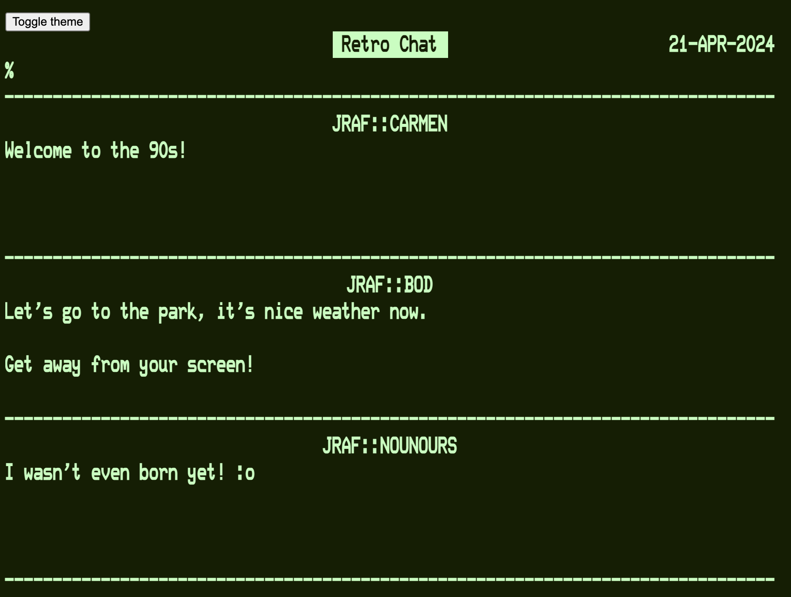
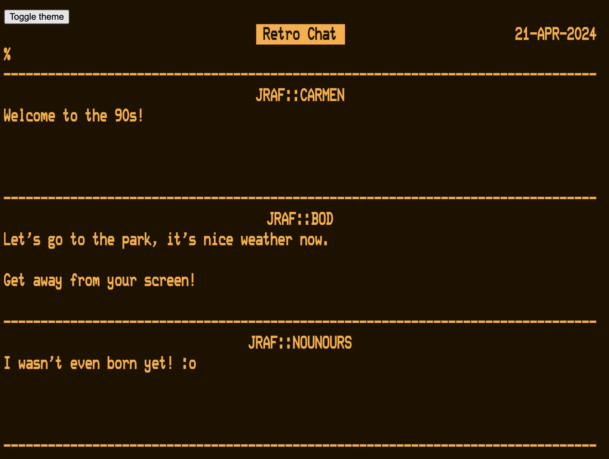

# Retro chat app

This project is a chat application which allows users to see each other typing in real time (character-by-character).

It is inspired by [Unix talk](https://en.wikipedia.org/wiki/Talk_(software)) and the OpenVMS Phone utility.

## Running

### From sources

Run the application:
```
docker compose up --build
```
Open the application in your web browser: http://localhost:8000/client/index.html

#### Green theme


#### Amber theme


### From the hosted docker image

Coming soon...


## Development
Run only redis from Docker:
```
docker compose up redis
```

### Server
* Go into the `server` folder.
* Activate your python virtual environment.
* Configure CORS:
  - Copy `.env.template` to `.env`
  - Set `REDIS_DSN="redis://localhost:6379/"`
  - Set `CORS_ALLOWED_ORIGINS` to contain the host of your local webapp. To access it from your machine, set `CORS_ALLOWED_ORIGINS=["http://localhost:5173"]`. 
* Run the server: `python -m phone.main`.

### Client
* Go into the `client` folder.
* Run the client: `yarn dev --host 0.0.0.0`
* Open the app at http://localhost:5173/client

Any changes to the client code will be hot reloaded (no need to restart or build the client).

### Access the webapp from another machine (CORS config)
To access the webapp from another machine:

From the `client` folder, run `yarn build`. This will copy a static distribution of the app to `client/dist`.
This folder is served as static resources, by the server.
You will also need to add your machine's IP address to the `CORS_ALLOWED_ORIGINS`.

For example, if your machine is at 192.168.1.12:

`server/.env`:
```
CORS_ALLOWED_ORIGINS=["http://localhost:5173", "http://192.168.1.12:8000"]
```

Restart the server (`python -m phone.main`) and access the application at http://192.168.1.12:8000/client/index.html.