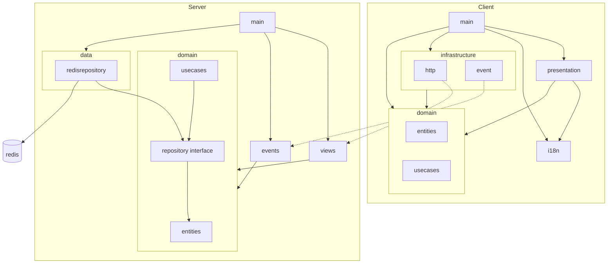

```mermaid
graph  
    subgraph Client
        client.main[main]
        presentation
        subgraph client.domain[domain]
            client.entities[entities]
            client.usecases[usecases]
        end
        i18n
        subgraph infrastructure
            http
            event
        end

        client.main --> presentation
        client.main --> i18n
        presentation --> client.domain
        presentation --> i18n
        client.main --> infrastructure
        client.main --> client.domain
        infrastructure --> client.domain
    end
    subgraph Server
        server.main[main]
        subgraph server.domain[domain]
            server.entities[entities]
            server.usecases[usecases]
            server.repository[repository interface]
            server.usecases --> server.repository
            server.repository --> server.entities
        end
        views
        events
        server.main --> views
        server.main --> events
        server.main --> data
        subgraph data
            redisrepository
        end

        events --> server.domain
        views --> server.domain
        redisrepository --> server.repository
    end
 
    event -.-> events
    http -.-> views
    redisrepository --> redis

    redis[(redis)]
```
